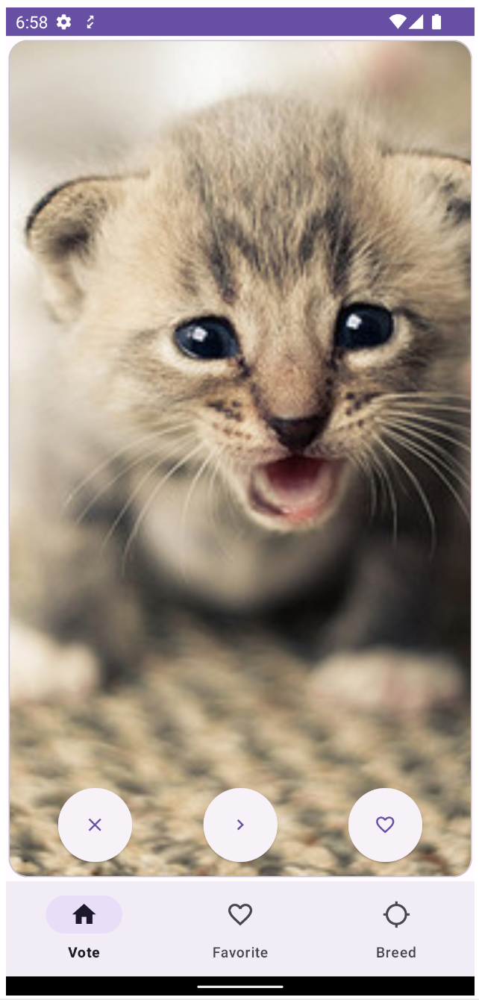
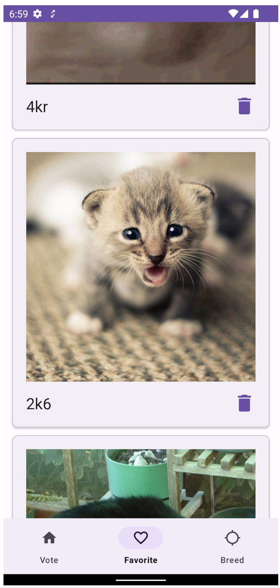

# android006-pets-sample

It follows Android design and development best practices and is intended to be a useful reference
for developers.

[](https://github.com/rx-mobile-team/android006-pets-sample/actions/workflows/buid-debug.yml)

## Tech stack

- Local data storage: [Room](https://developer.android.com/training/data-storage/room)
- Remote network: [Retrofit](https://square.github.io/retrofit/)
- [KotlinX Coroutines](https://kotlinlang.org/docs/coroutines-guide.html) for asynchronous
  programming
  and [Flow](https://kotlinlang.org/docs/flow.html) for reactive programming.
- MVVM pattern
  with [Android Lifecycle ViewModel](https://developer.android.com/topic/libraries/architecture/viewmodel)
- Dependency injection: [Hilt](https://dagger.dev/hilt/)
- Unidirectional data flow with [Flow](https://kotlinlang.org/docs/flow.html)
  and [Channels](https://kotlinlang.org/docs/channels.html)
- Clean architecture: Entity, UseCase, Repository, DataSources
- AndroidX StartUp for initializations

## Screenshots

|                Vote                |              Favorite               |
|:----------------------------------:|:---------------------------------:|
|  |  |

## License

DO NOT SHARE!!!

```
BSD 3-Clause License

Copyright (c) 2024, Rx Mobile Team
```
